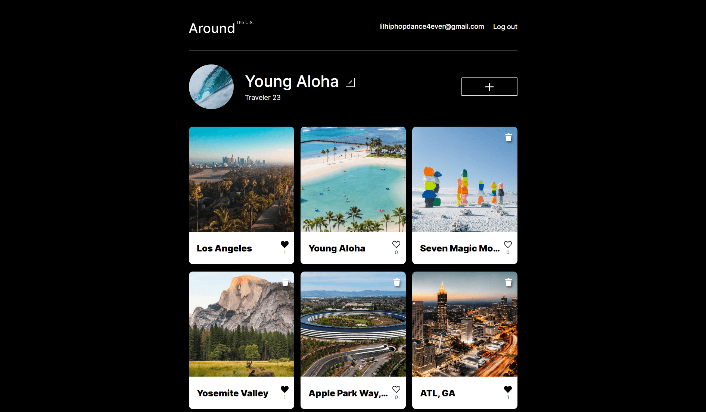

# Project 15: Around U.S Full-Stack Social Travel App 🌎

## **Developed By Chen Abudi** 👩‍💻

This repository contains the full API of "Around the U.S." project that features user authorization and user registration and handles cards and users.

This app was integrated between Backend & Frontend repositories, then deployed to _GCP_ (Google Cloud Platform) instance.

# Overview

- Intro
- Languages & Techniques
- Free Images Source
- Possible Improvements
- Live Project
- All Project Features

## Intro

This is a Full-stack interactive app with responsive design which enables travelers to share their travel photos by creating account.

## Languages & Techniques

- ReactJS
- Express.js
- Node.js
- MongoDB
- Deploy to _GCP_
- JWT server Auth
- localStorage
- CSS3
- Git/GitHub

| NPM Packages (Backend)               |                                                                                                                                                                                                         Aspects of Use |
| :----------------------------------- | ---------------------------------------------------------------------------------------------------------------------------------------------------------------------------------------------------------------------: |
| bcryptjs                             |                                                                                                                                                                                                    Password Encryption |
| body-parser                          |                                                                                                                              Returns middlewares that handle incoming requests before they reach a target controller . |
| celebrate                            |                                                                                                                                            It's an express middleware function that wraps the joi validation library . |
| cors (Cross-Origin Resource Sharing) | It is a mechanism to allow or restrict requested resources on a web server depend on where the HTTP request was initiated. This policy is used to secure a certain web server from access by other website or domain . |
| dotenv                               |                                                                                                                             automatically loads environment variables from a . env file into the process. env object . |
| express-winston                      |                                                                                                                                    Provides middlewares for request and error logging of your express.js application . |
| winston                              |                                                                                                                                                       Universal logging library with support for multiple transports . |
| validator                            |                                                                                                                                                                        A library of string validators and sanitizers . |
| jsonwebtoken                         |                                                                                                                                   An open standard for securely transferring data within parties using a JSON object . |
| express-rate-limit                   |                                                                                                                                Use to limit repeated requests to public APIs and/or endpoints such as password reset . |
| helmet                               |                                                                                                                                                   Helps you secure your Express apps by setting various HTTP headers . |

- NGINX - An open source software for web serving, reverse proxying, caching, load balancing, media streaming, and more.

## API Endpoints :

| RESTful API Enpoints | HTTP Methods |          Usage Purpose           |
| :------------------- | -----------: | :------------------------------: |
| /signup              |         POST |        User Registration         |
| /signin              |         POST |            User Login            |
| /users               |          GET |   GETting data from all users    |
| /users/:\_id         |          GET |    GETting user by their id.     |
| /users               |         POST | Creating a specific user profile |
| /users/me            |        PATCH |        Updating user data        |
| /users/me/avatar     |        PATCH |    Updating user avatar data     |
| /cards               |          GET |   GETting data from all cards    |
| /cards               |         POST |       Creating a new card        |
| /cards/:\_id         |       DELETE |      DELETE card by its id       |
| /cards/:\_id/likes   |          PUT |          Liking a card           |
| /cards/:\_id/likes   |       DELETE |         Disliking a card         |

## Free Images Source

- _For incredible images, Feel Free to_ [👉 **Click Here !**](https://unsplash.com/)

## Possible Improvements

- [ ] Create a Forgot Password option in case the users forgets theirs.
- [ ] Resets Password

# Live Project

- Visit the App [👉 **HERE !**](https://chen23-around-us.students.nomoredomainssbs.ru/) (Server IP 34.132.57.93)

- [Remote GCP Server API Deployment](https://api.chen23-around-us.students.nomoredomainssbs.ru/)

**Enjoy ! 🌺**

# All Project Features

- In first visitation, the users requires to sign up to create an account.

  - If the users has registered already, they can simply log in.
    
    

- Once the users logged in, there's no need to log back in again for 7 days at least, as this is the expiration duration of JWT token.

  - They will be navigated to the **Homepage** with several features to use.  
    

    - Edit their profile name, about, and their avatar image.
      
      

    - Adding their own cards to the collection.
      

    - Seeing others cards.

      - Capability to like or dislike own and others cards as well.
        

    - The users can remove their only their own and not others cards.
      

    - Click on card for opening popup with the image in bigger.
      
